# Martian Doves: A simple distributed state-machine processor

This repository implements a program that can load state machines from disk, process them, and write them back to disk.  This program is capable of cooperating with multiple instances of itself to distribute work based on a temporal semaphore.  This semaphore allows the instances to work together without using a centralized component to assign work.

In general, distributed work queues should make use of existing solutions to enforce consistency, but this  work was performed as part of an interviewing process, so it is written in python with no external services or additional packages.

## System Requirements
The system was developed and tested with:
* Python 3.8.10
* Docker version 20.10.16, build aa7e414
* Docker Compose version v2.5.0

## Getting Started
Before states can be copied to the shared volume, it must exist.  These steps describe how to create the volume, add state-files, and run the system to process the states.

1. Create the volume by running `docker compose up` in the base directory.  The system will log that it "Found 0 available machine states in /stateFiles.".  This is expected.  The important thing is that docker compose created the "martian-doves_states" Volume:
```
martian-doves$ docker compose up
[+] Running 2/0
 ⠿ Volume "martian-doves_states"     Created                                                                                                                                                                                                                              0.0s
 ⠿ Container martian-doves-worker-1  Created                                                                                                                                                                                                                              0.0s
Attaching to martian-doves-worker-1
martian-doves-worker-1  | Creating a OneAtATimeWorker with a SharedFileSource at 8189.15
martian-doves-worker-1  | Current phase is Worker Assignment (cycle time: 1.15)
martian-doves-worker-1  | Waiting until Update System (6.85 seconds remaining)...
martian-doves-worker-1  | Found 0 available machine states in /stateFiles.
martian-doves-worker-1  | No more work to do!
martian-doves-worker-1  |
martian-doves-worker-1  |
martian-doves-worker-1 exited with code 0
```

2. Connect a container to the volume with `docker run -d --rm -v martian-doves_states:/stateFiles --name dummy python:3.6.1-alpine tail -f /dev/null`

3. Copy states to the volume (through the dummy instance) like so:
```bash
docker cp simpleStates/goodbye.state dummy:/stateFiles/            
docker cp simpleStates/hello.state dummy:/stateFiles/              
docker cp simpleStates/howdoyoudo.state dummy:/stateFiles/         
docker cp interestingStates/countdown.state dummy:/stateFiles/     
docker cp interestingStates/slowcountdown.state dummy:/stateFiles/
```

4. Stop the dummy container with `docker stop dummy`.  The instance will automatically be deleted upon stopping.

5. Run the system with the desired number of workers (in this case 4) with `docker compose up --scale worker=4`.  Docker compose will create 4 workers and they will automatically distribute the workload on their own.

### Re-Runs
Once the run is complete, the flag-files will be recorded on the volume.  To clear the history, run the following:
```bash
# On the host
docker run -it --rm -v martian-doves_states:/stateFiles --name dummy python:3.6.1-alpine sh

# In the dummy container
rm /stateFiles/workers/*
rm /stateFiles/done/*

# optionally remove later states created from initial states
rm /stateFiles/*.state-*

# You may need to remove in_progress flags if the system was interrupted
rm /stateFiles/in_progress/*
```

# Additional Information
Interaction with the file system is broken up into three phases:
<p align="center">
  
</p>

1. **System Update:** During this phase, workers are allowed to mark states as "Done", and they may submit themselves as available for work.  Upon initialization, every worker waits for this state and registers as available before any work can be done.

2. **Worker Assignment:** State changes and worker updates are frozen during this phase, so that all available workers can access the same list of available states and workers.  The states are then assigned deterministically to workers to ensure no repeated work.

3. **Worker Commitment:** In this phase, workers that have received work remove their availability and begin processing their assignment.  The state is marked as "In Progress".  When completed, they will wait for the next "System Update" phase to mark themselves as available, and mark their state as "Complete."

The phases have fixed runtimes, so workers can infer which phase is active by dividing the current time (in seconds since epoch) by the time it takes to complete a cycle.  The modulus of this division is the amount of time that has passed within the current cycle.

For example, a semaphore with 3-second intervals for each phase (and 1-second buffers between them) has the following phases:
1. "Worker Assignment" Starts at 0 seconds, and ends just before 3 seconds.
2. "Worker Commitment" Starts at 4 seconds, and ends just before 7 seconds.
3.  "Update System" Starts at 8 seconds, and ends just before 11 seconds.

A worker that comes online at `1652942715.10` seconds since the epoch knows that `1652942715.10 % 12 = 3.10`, so it must wait `8 - 3.10 = 4.90` more seconds for the "Update System" phase.

## Example Machines  
To demonstrate the functionality of the system, a few state machines were defined.

**SimpleMachine** - Essentially "Hello World" with only a terminal state.  It prints a message and nothing more.
**CountdownMachine** - Keeps track of a count.  It prints a message and generates a new state with `count-=1`.
**SlowCountdownMachine** - Same as `CountdownMachine`, but it takes 10 seconds per count (intentionally over-stepping the cycle_time for testing purposes).

## Miscellaneous Notes  
Run arbitrary number of workers: `docker compose up --scale worker=5`

Copy state files to volume without a dummy:
1. Get volume Mountpoint with `docker volume inspect martian-doves_states`
2. Copy states from git repo with `sudo cp simpleStates/*.state <Mountpoint>`

View the shared volume with `docker run -it --rm -v martian-doves_states:/stateFiles python:3.6.1-alpine sh`

Clear flag-files from docker volume after testing (to re-run states).
```bash
rm /stateFiles/workers/*
rm /stateFiles/done/*
rm /stateFiles/in_progress/*

# remove later states created from initial states
rm /stateFiles/*.state-*
```

Clear local flags
```bash
rm simpleStates/workers/*
rm simpleStates/done/*
rm simpleStates/in_progress/*
rm interestingStates/workers/*
rm interestingStates/done/*
rm interestingStates/in_progress/*

# remove later states created from initial states
rm interestingStates/*.state-*
```

# TODO
* [X] Most basic implementation possible of Worker, Source, and Machine
* [X] Source to read from disk
* [X] Read from a shared dockerized volume (no consistency, tons of repeated work) with DiskSource
* [X] Verify that workers can alter disk and changes percolate
* [X] Consistent source reads from disk
* [X] Mermaid diagrams in Readme for worker state and example states
* [ ] Production logs instead of embarrassing print debug statements
* [X] Finalize Readme
